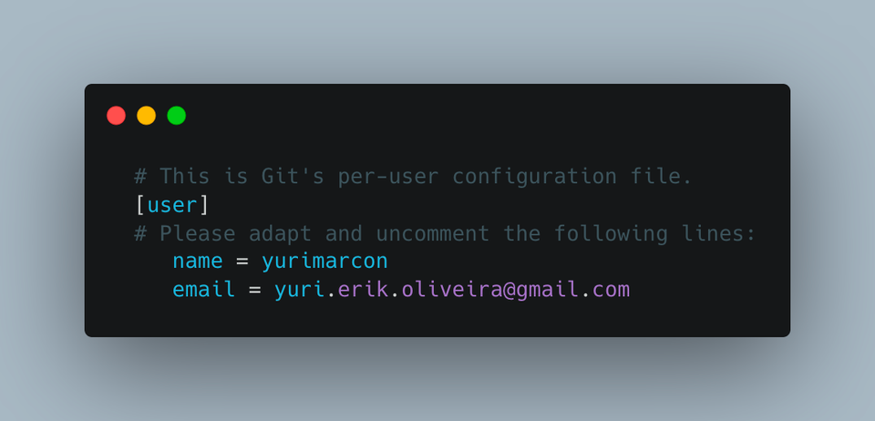

# Curso Git & GitHub

## Objetivo

- Ensinar como gerir projetos pessoais e de estudos com controle de versão e upload do projeto para o GitHub para manter backup e poder compartilhar com outras pessoas, dessa forma construindo um portfólio para apresentar em vagas de emprego.
- Explicar como funciona o controle de versão de código para trabalhar em grandes times de desenvolvimento utilizando Git e GitHub.

## O que veremos nesse curso

- Criação de repo.
- Configuração do repositório local.
- Estágios ⇒ ****modified, staged e committed.****
- Upload e clonagem de projetos do GitHub.
- O que é o arquivo .gitignore e como trabalhar com ele.
- Criação e gerenciamento de branchs.
- O que é Stash.
- Merge.
- Resolução de conflitos.
- Como criar um Pull Request.
- Git Flow.

## Comandos mais utilizados:

### 1. git config —global -e

Esse comando vai abrir uma tela semelhante com a imagem a baixo, preencha com seu e-mail do GitHub e o nome que você preferir:

(Normalmente configuramos o usuario apenas uma vez, mesmo assim mantive esse comando na lista pois é uma configuração muito importante)

### 2. git init

Cria o “repo” local, após isso seu repositório ou projeto está pronto para trabalhar com o controle de versão do Git.

### 3. git remote add https://github.com/<nome-do-perfil>/<nome-do-projeto>

Caso você tenha criado o repositório local, depois criou um repositório no GitHub, você precisa falar para seu repositório local qual o endereço dele no GitHub. Esse comando adiciona nas configurações do projeto local, qual o endereço desse projeto no GitHub.

### 4. git clone https://github.com/<nome-do-perfil>/<nome-do-projeto>

Clona um repositório para a sua máquina. (Pode ser um repositório seu ou qualquer repositório aberto)

### 5. git add .

Prepara as alterações para poder serem commitadas, ou seja, fala para o Git “Estou pronto para commitar todas as minhas alterações!!!”

### 6. git commit -m “<descrição-das-suas-alterações>”

Commita suas alterações, por exemplo: git commit -m “Criação de projeto, configurações iniciais e upload para o GitHub”

Esse comando a cima cria um commit com essa descrição, onde conseguimos consultar no histórico do repositório quando e quais foram as alterações feitas quando foi criado esse commit.

### 7. git status

Mostra se seu repositório possui alterações pendentes, se está pronto para mandar para o GitHub, dentre outras informações.

### 8. git fetch

Traz apenas os commits do GitHub para atualizar seu repositório Git local.

### 9. git pull

Traz as últimas atualizações do GitHub para o seu repositório Git loca.

### 10. git push -u origin <nome-da-branch>

Caso o comando “git pull” der erro, provavelmente seu projeto ainda não sabe qual o endereço da sua branch dentro do projeto do GitHub, então o comando a cima será necessário no primeiro upload do seu projeto.

### 11. git push

Faz upload da sua branch para o GitHub.

### 12. git branch

Lista suas branchs locais.

### 13. git checkout -b <nome-da-nova-branch>

Cria uma nova branch com base na branch atual e vai para a nova.

### 14. git checkout <nome-da-branch>

Vai para outra branch do projeto.

### 15. git merge <nome-da-branch-que-voce-quer-mergear-com-a-atual>

Traz todas as alterações de outra branch para “mergear”com a branch atual.

---
## Contatos

Email: yuri.erik.oliveria@gmail.com