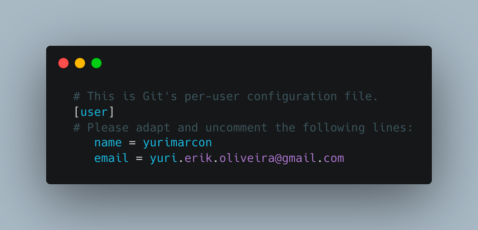

# Curso Git & GitHub



## 🎯 Objetivo

- Ensinar como gerir projetos pessoais e de estudos com controle de versão e upload do projeto para o GitHub para manter backup e poder compartilhar com outras pessoas, construindo um portfólio para apresentar em vagas de emprego.
- Explicar como funciona o controle de versão de código para trabalhar em grandes times de desenvolvimento utilizando Git e GitHub.

---

## 🔧 Pré-requisitos

### Instalação do Git
Baixe o Git: [Git Downloads](https://git-scm.com/downloads/win)

### Configuração do usuário
```bash
# Configure seu nome e email globalmente para o Git
git config --global user.name "Seu Nome"
git config --global user.email "seuemail@gmail.com"

# Para listar todas as configurações
git config --list
# Abre o editor configurado para editar configs
git config --global -e
```
*Comentários:* Garantir que o nome e email estejam corretos é importante para rastrear quem fez cada commit.

---

## 🏗️ Trabalhando com Repositório Local

### Inicializando um repositório
```bash
# Cria um repositório Git na pasta atual
git init
# Define o nome da branch principal
 git config --global init.defaultBranch "main"
# Altera o nome da branch atual se necessário
git branch -m "name"
```
*Comentários:* git init é o primeiro passo para começar o versionamento do seu projeto.

### Criando e commitando arquivos
```bash
# Cria um arquivo (ainda não rastreado pelo Git)
touch arquivo.formato
# Verifica o status da pasta
git status
# Adiciona o arquivo para ser commitado
git add arquivo.formato
# Realiza o commit com mensagem explicativa
git commit -m "meu primeiro commit"
# Verifica novamente o status
git status
```
*Comentários:* Untracked = não reconhecido; Modified = modificado; Staged = pronto para commit.

### Git Add múltiplos arquivos
```bash
git add .           # Adiciona todos os arquivos modificados
git add -a          # Igual ao anterior
git add --all       # Igual aos anteriores
# Commit direto com adição de arquivos modificados
git commit -a
# Commit com mensagem direta
git commit -m "descrição do commit"
# Add e commit juntos
git commit -am "descrição do commit"
```
*Comentários:* Facilita quando há muitos arquivos, evitando add individual.

---

## 📊 Visualizando alterações

### Git Diff
```bash
git diff             # Mostra alterações em todos os arquivos
git diff arquivo     # Mostra alterações de um arquivo específico
git diff --cached   # Mostra alterações já adicionadas (staged)
```
*Comentários:* Útil para revisar antes de commitar e evitar erros.

### Git Log
```bash
git log              # Mostra histórico de commits detalhado
git log -1           # Último commit
git log --oneline    # Resumo em linha única
git log --oneline -2 # Últimos 2 commits
git log --patch      # Mostra alterações do último commit
git log --stat       # Mostra arquivos alterados em cada commit
```
*Comentários:* Ajuda a entender histórico e evolução do projeto.

### Git Checkout e Restore
```bash
# Navegar entre commits ou branches
git checkout hash    # Ex.: git checkout 8a5c205
git checkout branch  # Volta para branch principal
git restore arquivo  # Desfaz alterações de um arquivo
git restore --staged # Remove do staged, volta para modified
```
*Comentários:* Use com cuidado para não perder alterações importantes.

### Git Commit Amend e Reset
```bash
# Edita a mensagem do último commit
git commit --amend -m "nova descrição"

# Desfaz commits (perigoso, apaga alterações)
git reset --hard HEAD^1 # Deleta último commit
git reset --hard HEAD^3 # Deleta últimos 3 commits
```
*Comentários:* Amend é seguro para commits locais, reset --hard apaga permanentemente.

---

## 🌿 Branches e Merge

```bash
# Listar branches
 git branch --list
git branch

# Criar branch e navegar para ela
git branch feature/about-page
git checkout -b <nome_da_branch>
git switch -c <nome_da_branch>

# Navegar entre branches
git checkout <nome_da_branch>
git switch <nome_da_branch>
git switch - # Volta para branch anterior

# Deletar branch
git branch -d <nome_da_branch>

# Mesclar branches
git merge <nome_da_branch>
git rebase <nome_da_branch>
```
*Comentários:* Merge adiciona alterações de outra branch; rebase sincroniza sem criar commit de merge.

---

## 🌐 GitHub: Conectando e enviando

```bash
# Mostrar origem do projeto
 git remote -v
# Adicionar origem
 git remote add <name> <url>
# Remover origem
 git remote remove <name>

# Enviar alterações para GitHub
 git push
# Verificar atualizações no GitHub
 git fetch
# Trazer alterações do GitHub
 git pull
# Deletar branch do GitHub
 git push origin --delete minha-branch
```
*Comentários:* Sempre verificar remote e status antes de push.

### Clonando repositórios
```bash
git clone <path> <new_folder> # Clona repositório e cria nova pasta
```

### Criando chave SSH
```bash
ssh-keygen          # Gera chave
ls ~/.ssh            # Lista chaves
cat ~/.ssh/numerotoken.pub  # Copia conteúdo da chave
# No GitHub: Settings → SSH and GPG Keys → New SSH Key
```

### Tags no Git
```bash
git tag <name> <optional_hash>
git tag -am "Bugfix text field" <name> <optional_hash>
git tag --list
git show <name>
git tag -d <name>
git push origin <name>
git push --tags
# Navegar para tag específica
git checkout <nome_tag>
```
*Comentários:* Tags são úteis para marcar versões estáveis.

---

## .GITIGNORE
```bash
# Arquivos ou pastas que não serão versionados
https://github.com/github/gitignore # Templates de gitignore
```
*Comentários:* Mantém senhas, dados sensíveis ou arquivos temporários fora do commit.

---

## Contato
Email: yuri.erik.oliveria@gmail.com
